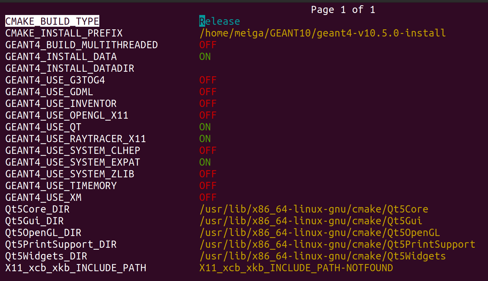

# Installing_GODDeSS
Repository for installing GODDeSS framework at Geant4 v.10.05.0

## Installing Geant4 v. 10.05.0

Create a folder where Geant4 will be installed:
```bash
mkdir /home/USER/Geant4/
```

Download the .tar.gz file of Geant4 v.10.05.0 from official page:
```html
https://geant4.web.cern.ch/download/10.5.0.html
```
or from this repository at sourceFILE folder.

Move the zip file to the folder you created above and unzip using:
```bash
tar -xvf geant4-v10.5.0.tar.gz
```
This command will create a folder with the same name.
Move to that folder and create a build folder.
```bash
mkdir geant4-v10.5.0/build
```

Move to build folder:
```bash
cd geant4-v10.5.0/build
```
and execute ```bash ccmake ..``` to configure the installation process. Press ``` c ``` the first time.
Edit the configuration file so that it looks like:



WARNING: Be carefull with CMAKE_INSTALL_PREFIX, that is the folder where Geant4 will be installed.
Then, press ``` g ``` to generate and execute the next command:
```bash
make -jN
```
where ``` N ``` is the number of threads to compile. I recommended to use ``` make -j4 ```.
After the compilation process, execute ``` make install ```. 

If you are using modern versions of Cmake and the program does not compile, you need to modify some libraries.
For cmake 3.28.3 and gcc 13.3.0 you need to modify 2 files in order to compile Geant4

First, open ```G4tgrEvaluator.cc``` using a text editor:
```bash
nano /home/user/geant4-v10.5.0/source/persistency/ascii/src/G4tgrEvaluator.cc
```
then, go to line:
```c++
G4double fsqrt( G4double arg ){  return std::sqrt(arg); }
```
and modify ```c++ fsqrt``` into ```c++ g4_fsqrt``` so it looks like:
```c++
G4double g4_fsqrt( G4double arg ){  return std::sqrt(arg); }
```

Second, in the same file, go to line:
```c++
setFunction("sqrt", (*fsqrt));
```
and modify ```c++ *fsqrt``` into ```c++ *g4_fsqrt``` so it looks like:
```c++
setFunction("sqrt", (*g4_fsqrt));
```

After modify these files, you can compile Geant4 and execte ``` make install ```.

### Ensure your installation was succesfull
In order to test the installation procces you can run examples simulation of Geant4.
Before you can run example, you need 'activate' Geant4, open ``` .bashrc ``` file:
```bash
nano ~/.bashrc
```
At the end of this file, add the next lines: (be carefull with the paths)
```bash
alias geant4make="source /home/USER/GEANT10/geant4-v10.5.0-install/Geant4-10.5.0/geant4make/geant4.>
source "/home/USER/GEANT10/geant4-v10.5.0-install/bin/geant4.sh"
```
then save and quit. Close your terminal and open another one to activate the changes.

To test Geant4, move to B1 example
```bash
/home/USER/GEANT10/geant4-v10.5.0-install/share/Geant4-10.5.0/examples/basic/B1
```
create and move to build folder ``` mkdir build ```, ``` cd build ```
then, execute the next commads to compile the example:
```bash
cmake ..
make
```
a executable ``` exampleB1 ``` will be created. Finally, execute the example
``` ./exampleB1 ```
If you can see a new window where the exaple B1 is running, your installation process of Geant4 was succesfull.


